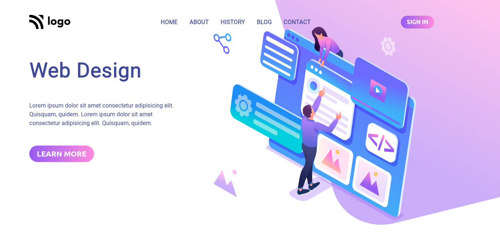
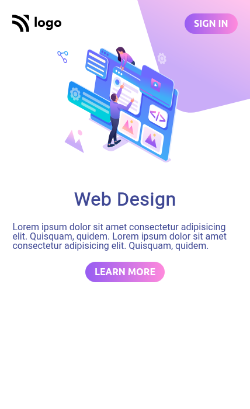

# Landing page for a webdesigning company

Made by **Aditya Kadali**

## Screenshots:

## Built with:

- Semantic HTML
- CSS
- Flexbox

## Key learnings:

- In this project I learned to handle svgs correctly on a web page.
- I learned to position svgs correctly.

## Time taken:

- It took me a little more than an hour to code this landing page.

## Links:

- [Live Demo](https://webdesign-solutions.netlify.app/)
- [Source code](https://github.com/Adityakadali/Webdesign-Landingpage)
